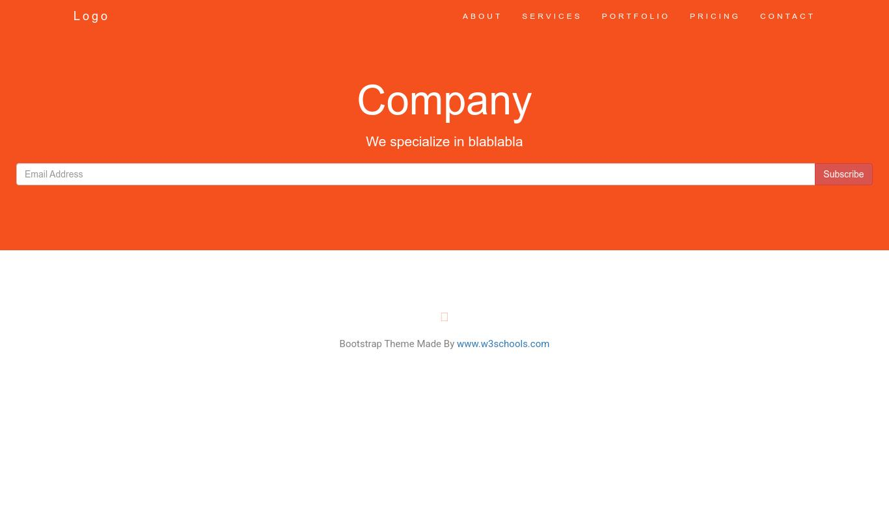

# recriar-site-para-react
tutorial https://youtu.be/3I9xv-t42Q4
recriar uma landinpage feita em html-css para um projeto react com rotas
landingpage w3schooll
https://www.w3schools.com/bootstrap/trybs_theme_company_full.htm

projeto em react com Browser com rotas
https://ruben-comapany.netlify.app/


# ep2 convertendo HTML para JSX
instalar 
```
npx create-react-app company
```

instalar 
```
cd company
npm start
```

modifique App.js 
```
<div className="App">
     
</div>
```

apague os arquivos
```
App.css
logo.svg
```


add em public/index.html
```
 <link rel="stylesheet" href="https://maxcdn.bootstrapcdn.com/bootstrap/3.4.1/css/bootstrap.min.css">
  <link href="https://fonts.googleapis.com/css?family=Montserrat" rel="stylesheet" type="text/css">
  <link href="https://fonts.googleapis.com/css?family=Lato" rel="stylesheet" type="text/css">
```
criar um arquivo CSS public/estilo.css e adicione o conteudo css nele, add o link do public/index.html
```
 <link rel="stylesheet"  href="%PUBLIC_URL%/estilo.css" />>
 ```

Crie um Componente Site.js

Copie o conteudo de body do html
```html
https://magic.reactjs.net/htmltojsx.htm
```

Add componente site no App.jsx
```
import Site from "../../Site";
<Site />
```

Dividir o site em componentes

Criar rotas
```
npm i react-router-dom

import { BrowserRouter, Routes, Route } from 'react-router-dom';
```

